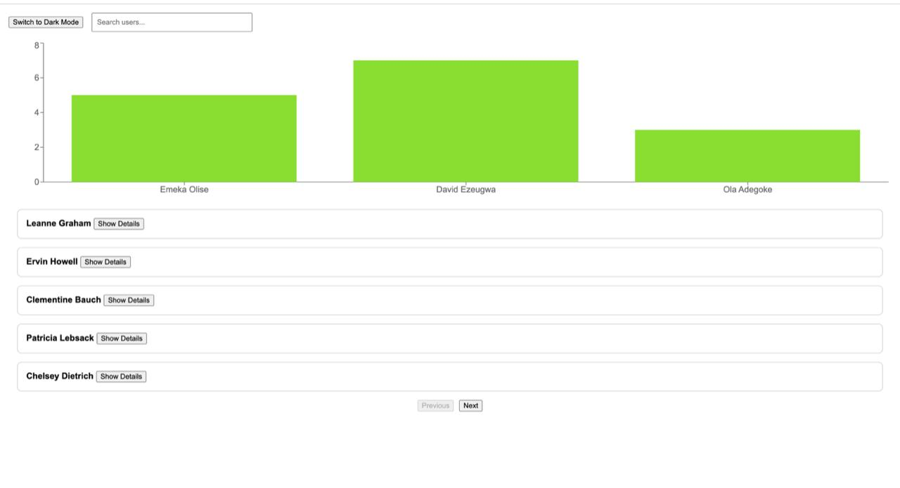

# React Dashboard with Charts

A modern, responsive React + TypeScript dashboard that displays a list of users with pagination, search and filtering capabilities, detailed user views, and integrated analytics charts. Built using best practices with React Query, Recharts, Jest and Styled Components, supporting both light and dark themes.

## Features

-  **User List** with pagination and real-time search/filter  
-  **User Detail View** with detailed user information  
-  **Analytics Charts** using `Recharts`  
-  **Light/Dark Theme Toggle**  
-  **Performance Optimized** with lazy loading  
-  **Data Fetching** via `React Query`  
-  **Modular and Component-driven** architecture  
-  **Test Coverage** using Jest and React Testing Library  
-  **Fully Responsive Design**


## Setup and Installation

1. **Clone the repository**

```bash
git clone https://github.com/ezeugwadavid/auto-chek.git
```

2. **Install the project dependencies:**

```bash
cd user-dashboard
npm install
```

3. **Run the App Locally:**

```bash
npm run dev
```

4. **Run Tests:**

```bash
npm test
```


## Tech Stack

- **Framework:** React + TypeScript  
- **Styling:** Styles Components  
- **Charts:** Recharts  
- **Data Management:** React Query  
- **Testing:** Jest, React Testing Library  

## Screenshots




